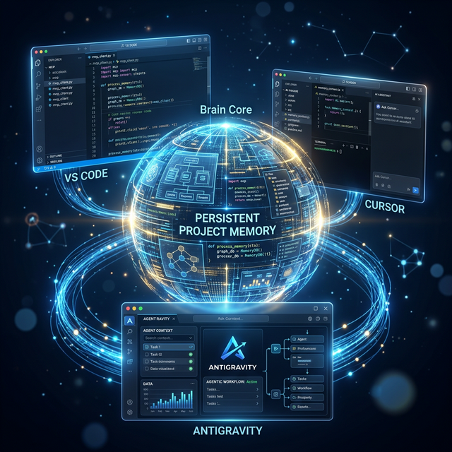

#  IDE Memory MCP

A cross-IDE **persistent memory layer** for AI coding agents, built on the [Model Context Protocol (MCP)](https://modelcontextprotocol.io).

Switch IDEs (Cursor → VS Code → Windsurf → Claude Desktop → Antigravity) and your AI coding agent **instantly remembers** your project — architecture, decisions, file layout, gotchas — instead of starting from scratch every session.

---


##  What It Does

When you open a project in any MCP-compatible IDE, this server lets the agent:

1. **Register** the project on first use (or reconnect silently on return)
2. **Scan** the directory tree automatically
3. **Store** structured context: overview, structure, decisions, active work, progress
4. **Load** it instantly in any other IDE — same machine or different machine (via git remote)

---

## 🚀 Quick Start

### Prerequisites
- Python 3.11+
- [uv](https://docs.astral.sh/uv/) package manager

### Install

```bash
git clone https://github.com/prasanna-pmpeople/IDE-Memory-MCP.git
cd IDE-Memory-MCP
uv sync
```

### Run (stdio mode for IDEs)

```bash
uv run ide-memory-mcp
```

### Test with the inspector

```bash
uv run mcp dev src/ide_memory_mcp/server.py
```

---

## 🔧 IDE Configuration

Add this to your IDE's MCP config file:

**Antigravity** — `%APPDATA%\Antigravity\mcp_config.json`  
**Claude Desktop** — `claude_desktop_config.json`  
**Cursor** — `.cursor/mcp.json`  
**VS Code** — `.vscode/mcp.json`

```json
{
  "mcpServers": {
    "ide-memory": {
      "command": "uv",
      "args": ["--directory", "C:/path/to/IDE-Memory-MCP", "run", "ide-memory-mcp"]
    }
  }
}
```

---

##  Tools Reference

| Tool | Input | Description |
|------|-------|-------------|
| `init_project` | `projectPath`, `projectName?`, `gitRemoteUrl?` | Register or reconnect. Auto-detects git, auto-creates folder if missing. |
| `scan_project_structure` | `projectIdOrPath`, `maxDepth?`, `maxFiles?` | Scan directory tree → save to `structure` section. |
| `load_memory` | `projectIdOrPath` | Load all 5 memory sections as markdown. |
| `update_memory` | `projectIdOrPath`, `sections` | Overwrite one or more sections. |
| `get_memory_section` | `projectIdOrPath`, `section` | Read a single section. |
| `list_projects` | — | List all registered projects. |
| `prune_memory` | `projectIdOrPath` | Load memory so the agent can clean it up and call `update_memory`. |

> All tools accept **either a project ID or an absolute path** for `projectIdOrPath`.

---

## 📁 Memory Structure

Memory is stored in `~/.ide-memory/projects/<hash>/`:

```
~/.ide-memory/projects/
  └── c4ab9b46c299/
      ├── meta.json          # ID, name, path, git remote, timestamps
      ├── overview.md        # Tech stack, architecture, purpose
      ├── structure.md       # Auto-scanned directory tree
      ├── decisions.md       # Architectural decisions & rationale
      ├── active_context.md  # Current work, recent changes
      └── progress.md        # Milestones, TODOs, known issues
```

Plain markdown — human-readable, git-diffable, editable by hand.

---

##  Agent Workflow

### New project
```
Agent: init_project(projectPath)
  →  ACTION REQUIRED: fill memory
Agent: scan_project_structure(projectId)
  → tree auto-saved to structure section
Agent: update_memory(projectId, { overview, decisions, active_context, progress })
  → all sections filled
```

### Returning to a project
```
Agent: init_project(projectPath)
  →  Reconnected — memory sections already present
Agent: load_memory(projectId)
  → full context restored instantly
```

### Switching IDEs
Same flow — `init_project` on the same path (or git-matched path) reconnects automatically.

---

##  Project Matching

Projects are matched in this priority order:

1. **Exact path** — same machine, same location
2. **Normalized path** — handles case differences & slash differences on Windows
3. **Git remote URL** — different machine or cloned to a new folder (SSH/HTTPS/.git agnostic)

When matched by git remote, the stored path is auto-updated to the new location.

---

##  Agent Behavioral Hints

The server tells agents what to do at each step:

- **On new project**: calls `scan_project_structure` then `update_memory` automatically
- **On reconnect with empty sections**: reminded to fill missing sections
- **After every update**: reminded to call `update_memory` again on next change

---

## Smart Pruning (Agent-driven)

When memory grows stale, ask the agent to prune it — no external tools needed:

```
User: "Clean up the project memory, remove anything outdated"
Agent: prune_memory(projectIdOrPath)
  → Returns all sections with pruning instructions
Agent: (analyzes with its own understanding of the project)
Agent: update_memory(projectId, { ... cleaned sections ... })
```

The agent is better at this than any local LLM — it already has full project context and knows what's actually outdated.

---

##  V1 — Verified Features

All of the following have been tested end-to-end:

- [x] Cross-IDE persistence (Antigravity ↔ VS Code)
- [x] Git-based cross-repo/cross-machine matching
- [x] Path-based tool lookup (no need to look up IDs)
- [x] Auto directory tree scanning
- [x] Agent behavioral hints (auto-fill on new project)
- [x] Windows path normalization (case, slashes)
- [x] Auto-creation of missing project folders
- [x] Agent-driven memory pruning (no external LLM needed)

---

