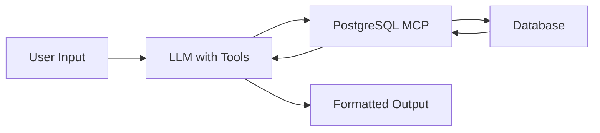

# Agent Testing Suite - PostgreSQL MCP Server
## Complete Testing Flow for Video Recording & Flowise Integration

This testing suite creates a realistic e-commerce database with complex relationships to demonstrate all MCP capabilities in a logical, production-like scenario.

---

##  Testing Flow Overview

**Scenario**: Building an E-Commerce Order Management System

**Duration**: ~15-20 minutes for complete flow

**Order of Operations**:
1. Initial Database Analysis (baseline)
2. Create Database Schema (5 related tables)
3. Test CRUD Create Operations
4. Test CRUD Read Operations  
5. Test CRUD Update Operations
6. Test Schema Modifications
7. Test CRUD Delete Operations
8. Generate Visual Diagrams
9. AI-Powered Database Explanation (finale)

---

##  Step-by-Step Testing Script

###  Prerequisites

Ensure your MCP server is configured and running with:
- PostgreSQL database accessible
- `.env` file with correct credentials
- Ollama running (optional, for step 9)

---

###  STEP 1: Initial Database Check (Baseline)

**Goal**: Understand the current state before we build anything

**Test Commands**:
```
Agent Prompt 1: "Show me what tables currently exist in the database"
Expected Tool: get_database_info(info_type="tables")
Expected Result: Empty list or existing tables

Agent Prompt 2: "Check if Ollama is available for enhanced analysis"
Expected Tool: get_database_info(info_type="ollama")
Expected Result: Ollama status (available or not)
```

**✅ Success Criteria**: You understand the starting state

---

### 🏗️ STEP 2: Create Database Schema (Complex E-Commerce)

**Goal**: Build 5 interconnected tables with FK/PK relationships

#### 2.1 Create Users Table (Root Entity)

**Agent Prompt**: 
```
"Create a users table with these columns:
- id (INTEGER, primary key, not null)
- username (VARCHAR 50, not null)
- email (VARCHAR 100, not null)
- created_at (TIMESTAMP, nullable)
- status (VARCHAR 20, nullable)
Set id as the primary key"
```

**Expected Tool**: `crud_create_table`
**Parameters**:
```json
{
  "table_name": "users",
  "columns": [
    {"name": "id", "type": "INTEGER", "nullable": false},
    {"name": "username", "type": "VARCHAR(50)", "nullable": false},
    {"name": "email", "type": "VARCHAR(100)", "nullable": false},
    {"name": "created_at", "type": "TIMESTAMP", "nullable": true},
    {"name": "status", "type": "VARCHAR(20)", "nullable": true}
  ],
  "primary_key": ["id"]
}
```

---

#### 2.2 Create Categories Table

**Agent Prompt**:
```
"Create a categories table with:
- id (INTEGER, primary key, not null)
- name (VARCHAR 100, not null)
- description (TEXT, nullable)
Set id as the primary key"
```

**Expected Tool**: `crud_create_table`

---

#### 2.3 Create Products Table (Foreign Key to Categories)

**Agent Prompt**:
```
"Create a products table with:
- id (INTEGER, primary key, not null)
- name (VARCHAR 200, not null)
- description (TEXT, nullable)
- price (DECIMAL 10,2, not null)
- stock_quantity (INTEGER, not null)
- category_id (INTEGER, nullable)
Set id as the primary key"
```

**Expected Tool**: `crud_create_table`

**Then Add Foreign Key**:
```
"Add a foreign key constraint on products table: 
products.category_id should reference categories.id with CASCADE on delete"
```

**Expected Tool**: `mod_add_constraint`
**Parameters**:
```json
{
  "constraint_type": "foreign_key",
  "table_name": "products",
  "spec": {
    "columns": ["category_id"],
    "ref_table": "categories",
    "ref_columns": ["id"],
    "on_delete": "CASCADE"
  }
}
```

---

#### 2.4 Create Orders Table (Foreign Key to Users)

**Agent Prompt**:
```
"Create an orders table with:
- id (INTEGER, primary key, not null)
- user_id (INTEGER, not null)
- order_date (TIMESTAMP, not null)
- total_amount (DECIMAL 10,2, not null)
- status (VARCHAR 20, not null)
Set id as the primary key"
```

**Expected Tool**: `crud_create_table`

**Then Add Foreign Key**:
```
"Add a foreign key: orders.user_id references users.id with CASCADE on delete"
```

**Expected Tool**: `mod_add_constraint`

---

#### 2.5 Create Order_Items Table (Junction Table - Many-to-Many)

**Agent Prompt**:
```
"Create an order_items table with:
- id (INTEGER, primary key, not null)
- order_id (INTEGER, not null)
- product_id (INTEGER, not null)
- quantity (INTEGER, not null)
- unit_price (DECIMAL 10,2, not null)
Set id as the primary key"
```

**Expected Tool**: `crud_create_table`

**Then Add Two Foreign Keys**:
```
"Add foreign key: order_items.order_id references orders.id with CASCADE on delete"
"Add foreign key: order_items.product_id references products.id with RESTRICT on delete"
```

**Expected Tools**: `mod_add_constraint` (called twice)

---

#### 2.6 Create Indexes for Performance

**Agent Prompt**:
```
"Create an index on users table for the email column to speed up lookups"
```

**Expected Tool**: `crud_create_index`
**Parameters**:
```json
{
  "index_name": "idx_users_email",
  "table_name": "users",
  "columns": ["email"],
  "unique": false
}
```

**Agent Prompt**:
```
"Create a composite index on orders table for user_id and order_date columns"
```

**Expected Tool**: `crud_create_index`
**Parameters**:
```json
{
  "index_name": "idx_orders_user_date",
  "table_name": "orders",
  "columns": ["user_id", "order_date"],
  "unique": false
}
```

---

### ✅ CHECKPOINT 1: Verify Schema Creation

**Agent Prompt**: "List all tables in the database now"

**Expected Tool**: `get_database_info(info_type="tables")`
**Expected Result**: 5 tables (users, categories, products, orders, order_items)

**Agent Prompt**: "Show me all foreign key constraints in the database"

**Expected Tool**: `mod_constraint(action="list")`
**Expected Result**: 4 FK constraints

---

### 📝 STEP 3: Populate Database with Test Data (CRUD Create)

#### 3.1 Insert Users (Batch Insert)

**Agent Prompt**:
```
"Insert these three users into the users table:
1. username: john_doe, email: john@example.com, status: active
2. username: jane_smith, email: jane@example.com, status: active
3. username: bob_wilson, email: bob@example.com, status: inactive"
```

**Expected Tool**: `crud_insert`
**Parameters**:
```json
{
  "table_name": "users",
  "data": [
    {"id": 1, "username": "john_doe", "email": "john@example.com", "status": "active", "created_at": "2024-01-15 10:00:00"},
    {"id": 2, "username": "jane_smith", "email": "jane@example.com", "status": "active", "created_at": "2024-01-16 11:30:00"},
    {"id": 3, "username": "bob_wilson", "email": "bob@example.com", "status": "inactive", "created_at": "2024-01-17 09:15:00"}
  ]
}
```

---

#### 3.2 Insert Categories

**Agent Prompt**:
```
"Insert these categories:
1. id: 1, name: Electronics, description: Electronic devices and gadgets
2. id: 2, name: Books, description: Physical and digital books
3. id: 3, name: Clothing, description: Apparel and accessories"
```

**Expected Tool**: `crud_insert` (batch)

---

#### 3.3 Insert Products

**Agent Prompt**:
```
"Insert these products:
1. id: 1, name: Laptop Pro, price: 1299.99, stock: 50, category_id: 1
2. id: 2, name: Wireless Mouse, price: 29.99, stock: 200, category_id: 1
3. id: 3, name: Python Programming Book, price: 49.99, stock: 100, category_id: 2
4. id: 4, name: T-Shirt Blue, price: 19.99, stock: 150, category_id: 3
5. id: 5, name: Smartphone X, price: 899.99, stock: 75, category_id: 1"
```

**Expected Tool**: `crud_insert` (batch)

---

#### 3.4 Insert Orders

**Agent Prompt**:
```
"Insert these orders:
1. id: 1, user_id: 1, order_date: 2024-02-01, total_amount: 1329.98, status: completed
2. id: 2, user_id: 2, order_date: 2024-02-05, total_amount: 949.98, status: shipped
3. id: 3, user_id: 1, order_date: 2024-02-10, total_amount: 49.99, status: pending"
```

**Expected Tool**: `crud_insert` (batch)

---

#### 3.5 Insert Order Items (Junction Table Data)

**Agent Prompt**:
```
"Insert order items:
1. Order 1: product_id 1 (Laptop), quantity 1, unit_price 1299.99
2. Order 1: product_id 2 (Mouse), quantity 1, unit_price 29.99
3. Order 2: product_id 5 (Smartphone), quantity 1, unit_price 899.99
4. Order 2: product_id 4 (T-Shirt), quantity 2, unit_price 19.99
5. Order 3: product_id 3 (Book), quantity 1, unit_price 49.99"
```

**Expected Tool**: `crud_insert` (batch)

---

### ✅ CHECKPOINT 2: Verify Data Insertion

**Agent Prompt**: "Count how many products are in the database"

**Expected Tool**: `crud_get(table_name="products", mode="count")`
**Expected Result**: 5 products

**Agent Prompt**: "Show me all orders with their total amounts ordered by date, limit to 10"

**Expected Tool**: `crud_get`
**Parameters**:
```json
{
  "table_name": "orders",
  "mode": "records",
  "options": {
    "order_by": "order_date DESC",
    "limit": 10
  }
}
```

---

### 🔍 STEP 4: Test CRUD Read Operations

#### 4.1 Simple Queries

**Agent Prompt**: "Get all active users"

**Expected Tool**: `crud_get`
**Parameters**:
```json
{
  "table_name": "users",
  "mode": "records",
  "where_clause": "status = %s",
  "where_params": ["active"]
}
```

---

#### 4.2 Complex Raw SQL Query (with JOIN)

**Agent Prompt**:
```
"Show me all orders with user details - I want order ID, username, email, 
order date, and total amount for orders placed in February 2024"
```

**Expected Tool**: `crud_query`
**Parameters**:
```json
{
  "query": "SELECT o.id, u.username, u.email, o.order_date, o.total_amount FROM orders o JOIN users u ON o.user_id = u.id WHERE o.order_date >= %s AND o.order_date < %s",
  "params": ["2024-02-01", "2024-03-01"]
}
```

---

#### 4.3 Aggregation Query

**Agent Prompt**: "Get the total number of products in each category"

**Expected Tool**: `crud_query`
**Parameters**:
```json
{
  "query": "SELECT c.name as category_name, COUNT(p.id) as product_count FROM categories c LEFT JOIN products p ON c.id = p.category_id GROUP BY c.id, c.name ORDER BY product_count DESC"
}
```

---

#### 4.4 Distinct Values

**Agent Prompt**: "Show me all distinct order statuses"

**Expected Tool**: `crud_get`
**Parameters**:
```json
{
  "table_name": "orders",
  "mode": "distinct",
  "options": {
    "column_name": "status"
  }
}
```

---

#### 4.5 Pagination

**Agent Prompt**: "Get page 1 of products with 3 items per page, ordered by price descending"

**Expected Tool**: `crud_get`
**Parameters**:
```json
{
  "table_name": "products",
  "mode": "paginate",
  "options": {
    "page": 1,
    "page_size": 3,
    "order_by": "price DESC"
  }
}
```

---

### ✏️ STEP 5: Test CRUD Update Operations

#### 5.1 Single Record Update

**Agent Prompt**: "Update product with id 5 - set the price to 799.99"

**Expected Tool**: `crud_update`
**Parameters**:
```json
{
  "table_name": "products",
  "record_id": 5,
  "id_column": "id",
  "values": {
    "price": 799.99
  }
}
```

---

#### 5.2 Batch Update

**Agent Prompt**: "Set all products with price less than 50 to have status 'budget' - wait, first add a status column to products"

**Agent Prompt (Step 1)**: "Add a status column to products table, VARCHAR(20), nullable"

**Expected Tool**: `mod_column`
**Parameters**:
```json
{
  "table_name": "products",
  "action": "add",
  "column_spec": {
    "name": "status",
    "type": "VARCHAR(20)",
    "nullable": true
  }
}
```

**Agent Prompt (Step 2)**: "Now update all products with price less than 50 to set status = 'budget'"

**Expected Tool**: `crud_update`
**Parameters**:
```json
{
  "table_name": "products",
  "where_clause": "price < %s",
  "where_params": [50],
  "values": {
    "status": "budget"
  }
}
```

---

#### 5.3 Update with NULL Check

**Agent Prompt**: "Update all products where status is NULL to set status = 'regular'"

**Expected Tool**: `crud_update`
**Parameters**:
```json
{
  "table_name": "products",
  "where_clause": "status IS NULL",
  "where_params": [],
  "values": {
    "status": "regular"
  }
}
```

---

### 🔧 STEP 6: Test Schema Modification Operations

#### 6.1 Modify Column Type

**Agent Prompt**: "Change the description column in products table to type TEXT (in case it wasn't already)"

**Expected Tool**: `mod_column`
**Parameters**:
```json
{
  "table_name": "products",
  "action": "modify_type",
  "column_name": "description",
  "column_spec": {
    "new_type": "TEXT"
  }
}
```

---

#### 6.2 Set Column Nullable

**Agent Prompt**: "Make the category_id column in products NOT NULL"

**Expected Tool**: `mod_column`
**Parameters**:
```json
{
  "table_name": "products",
  "action": "set_nullable",
  "column_name": "category_id",
  "column_spec": {
    "is_nullable": false
  }
}
```

---

#### 6.3 List All Indexes

**Agent Prompt**: "Show me all indexes in the database"

**Expected Tool**: `mod_index(action="list")`

---

#### 6.4 Create a View

**Agent Prompt**:
```
"Create a view called 'order_summary' that shows order ID, 
username, order date, and total amount by joining orders and users"
```

**Expected Tool**: `crud_create_view`
**Parameters**:
```json
{
  "view_name": "order_summary",
  "select_query": "SELECT o.id as order_id, u.username, o.order_date, o.total_amount FROM orders o JOIN users u ON o.user_id = u.id",
  "replace_if_exists": false
}
```

---

#### 6.5 List and Query View

**Agent Prompt**: "List all views in the database"

**Expected Tool**: `mod_view(action="list")`

**Agent Prompt**: "Get all records from the order_summary view"

**Expected Tool**: `crud_query`
**Parameters**:
```json
{
  "query": "SELECT * FROM order_summary"
}
```

---

### 🗑️ STEP 7: Test CRUD Delete Operations

#### 7.1 Delete Single Record

**Agent Prompt**: "Delete the user with id 3 (bob_wilson who is inactive)"

**Expected Tool**: `crud_delete`
**Parameters**:
```json
{
  "table_name": "users",
  "mode": "records",
  "record_id": 3,
  "id_column": "id"
}
```

**Note**: This should CASCADE delete related orders due to FK constraint!

---

#### 7.2 Delete Multiple Records (Batch)

**Agent Prompt**: "Delete all products with status 'budget'"

**Expected Tool**: `crud_delete`
**Parameters**:
```json
{
  "table_name": "products",
  "mode": "records",
  "where_clause": "status = %s",
  "where_params": ["budget"]
}
```

---

#### 7.3 Rename Operations

**Agent Prompt**: "Rename the 'categories' table to 'product_categories'"

**Expected Tool**: `crud_rename`
**Parameters**:
```json
{
  "object_type": "table",
  "old_name": "categories",
  "new_name": "product_categories"
}
```

**Agent Prompt**: "Rename it back to 'categories'"

**Expected Tool**: `crud_rename` (reverse)

---

### 📊 STEP 8: Generate Visual Diagrams

**Agent Prompt**: "Generate ER diagrams for the entire database in SVG format"

**Expected Tool**: `render_database_diagrams(output_format="svg")`

**Expected Result**: 
- erd_svg.svg file created
- flowchart_svg.svg file created
- Both in diagrams/ directory

**✅ Success Criteria**: You can open the SVG files and see:
- All 5 tables
- Foreign key relationships visualized
- Junction table (order_items) connecting orders and products
- Nice visual representation

---

### 🎯 STEP 9: Full Database Analysis (Baseline vs Current)

**Agent Prompt**: "Analyze the entire database structure and show me comprehensive details"

**Expected Tool**: `analyze_database()`

**Expected Result**:
- Complete schema
- Junction table detected (order_items)
- Implicit relationships found
- Join recommendations
- Mermaid ER diagram syntax
- Mermaid flowchart syntax
- Full Markdown documentation

---

### 🤖 STEP 10: AI-Powered Explanation (Grand Finale)

**Agent Prompt**: 
```
"Use the LLM to explain what this database does, its business purpose, 
and any recommendations for improvement"
```

**Expected Tool**: `explain_database()`

**Expected Result** (if Ollama available):
- Business purpose: "This is an e-commerce order management system..."
- Detected patterns: "Junction table for many-to-many between orders and products..."
- Recommendations: "Consider adding indexes on frequently joined columns..."
- Quality insights: "Good FK constraint usage, proper normalization..."

**If Ollama not available**: Error message, agent can acknowledge and continue


## 🔄 Flowise Testing Checklist

### Node Configuration

1. **PostgreSQL MCP Node**: Configure with your server
2. **LLM Node**: Connect to your preferred LLM
3. **Memory Node**: Optional for conversational context
4. **Output Parser**: To format results nicely

### Test Flow in Flowise



### Validation Points

- ✅ All 19 tools are accessible
- ✅ Complex multi-step operations work
- ✅ FK constraints are respected
- ✅ Batch operations execute correctly
- ✅ Error handling works (try invalid operations)
- ✅ Diagrams generate successfully

---

## 🎯 Success Metrics

By the end of this test suite:

1. ✅ **5 tables created** with proper relationships
2. ✅ **4 FK constraints** functioning correctly
3. ✅ **3 indexes** for performance
4. ✅ **15+ records** inserted across tables
5. ✅ **All CRUD operations** tested (Create, Read, Update, Delete)
6. ✅ **All 19 tools** exercised at least once
7. ✅ **Beautiful ER diagrams** generated
8. ✅ **Full database analysis** completed
9. ✅ **AI explanation** (if Ollama available)


## 🔍 STEP 11: Query Optimization Testing

### 11.1 Explain Query Performance

**Goal**: Analyze query execution plans to understand performance

**Agent Prompt 1** (Basic EXPLAIN):
```
"Explain the execution plan for this query: 
SELECT * FROM orders WHERE status = 'pending'"
```

**Expected Tool**: `query_explain`
**Parameters**:
```json
{
  "query": "SELECT * FROM orders WHERE status = 'pending'",
  "analyze": false,
  "format": "text"
}
```

**Expected Result**: Text-based execution plan showing scan type, cost estimates

---

**Agent Prompt 2** (EXPLAIN ANALYZE with actual execution):
```
"Analyze the actual execution of this query and show me the real timing: 
SELECT o.*, u.username FROM orders o JOIN users u ON o.user_id = u.id"
```

**Expected Tool**: `query_explain`
**Parameters**:
```json
{
  "query": "SELECT o.*, u.username FROM orders o JOIN users u ON o.user_id = u.id",
  "analyze": true,
  "format": "text"
}
```

**Expected Result**: Execution plan with actual row counts and timing information

**⚠️ Note**: `analyze=True` actually executes the query - safe for SELECT, caution with DML

---

**Agent Prompt 3** (JSON format for programmatic analysis):
```
"Give me the execution plan in JSON format for: 
SELECT product_id, COUNT(*) FROM order_items GROUP BY product_id"
```

**Expected Tool**: `query_explain`
**Parameters**:
```json
{
  "query": "SELECT product_id, COUNT(*) FROM order_items GROUP BY product_id",
  "analyze": false,
  "format": "json"
}
```

**Expected Result**: JSON-formatted execution plan for easy parsing

---

### 11.2 Analyze Indexes

**Goal**: Recommend missing indexes and find unused/wasteful ones — all via one tool

**Agent Prompt 1** (Suggest missing indexes for all tables):
```
"Analyze my database and suggest indexes that would improve performance"
```

**Expected Tool**: `query_analyze_indexes`
**Parameters**:
```json
{
  "mode": "suggest",
  "table_name": null
}
```

**Expected Result**:
- Indexes for foreign key columns (order_items.order_id, orders.user_id, etc.)
- Recommendations for large tables without primary keys
- Suggestions for timestamp/status columns with CREATE INDEX SQL

---

**Agent Prompt 2** (Suggest for one table):
```
"What indexes should I add to the orders table to improve query performance?"
```

**Expected Tool**: `query_analyze_indexes`
**Parameters**:
```json
{
  "mode": "suggest",
  "table_name": "orders"
}
```

**Expected Result**: Targeted recommendations for the orders table with CREATE INDEX SQL

---

**Agent Prompt 3** (Find wasteful indexes):
```
"Show me any indexes that are not being used and could be removed"
```

**Expected Tool**: `query_analyze_indexes`
**Parameters**:
```json
{
  "mode": "unused",
  "min_size_mb": 0
}
```

**Expected Result**: List of unused indexes with scan count, size, and DROP INDEX SQL

---

**Agent Prompt 4** (Full analysis):
```
"Give me a complete index analysis — what's missing and what's wasting space?"
```

**Expected Tool**: `query_analyze_indexes`
**Parameters**:
```json
{
  "mode": "all"
}
```

**Expected Result**: Combined report with both missing index suggestions and unused index findings

---

## 📤 STEP 12: Data Import/Export Testing

### 12.1 Export Data

**Goal**: Export table data to various formats

**Agent Prompt 1** (Export to JSON):
```
"Export all products to a JSON file called products.json"
```

**Expected Tool**: `data_export`
**Parameters**:
```json
{
  "table_name": "products",
  "format": "json",
  "where_clause": null,
  "output_path": "products.json",
  "limit": null
}
```

**Expected Result**: JSON file created with all product records

---

**Agent Prompt 2** (Filtered CSV export):
```
"Export all pending orders to CSV format, save it as pending_orders.csv"
```

**Expected Tool**: `data_export`
**Parameters**:
```json
{
  "table_name": "orders",
  "format": "csv",
  "where_clause": "status = 'pending'",
  "output_path": "pending_orders.csv",
  "limit": null
}
```

**Expected Result**: CSV file with filtered order data

---

**Agent Prompt 3** (SQL INSERT statements):
```
"Generate SQL INSERT statements for the first 10 users"
```

**Expected Tool**: `data_export`
**Parameters**:
```json
{
  "table_name": "users",
  "format": "sql",
  "where_clause": null,
  "output_path": null,
  "limit": 10
}
```

**Expected Result**: String of SQL INSERT statements for migration/backup

---

**Agent Prompt 4** (Export to string without file):
```
"Show me the products table data in CSV format"
```

**Expected Tool**: `data_export`
**Parameters**:
```json
{
  "table_name": "products",
  "format": "csv",
  "where_clause": null,
  "output_path": null,
  "limit": null
}
```

**Expected Result**: CSV data returned as string in response

---

### 12.2 Import Data

**Goal**: Import data from various sources

**Agent Prompt 1** (Import from CSV file):
```
"Import the data from products.csv into a new table called products_backup"
```

**Expected Tool**: `data_import`
**Parameters**:
```json
{
  "table_name": "products_backup",
  "format": "csv",
  "source": "products.csv",
  "mapping": null,
  "conflict_resolution": "error"
}
```

**Expected Result**: Import statistics showing rows imported/failed

---

**Agent Prompt 2** (Import JSON with upsert):
```
"Import this JSON data into users table, update if exists: 
[{\"id\": 1, \"username\": \"alice_updated\", \"email\": \"alice@example.com\"}]"
```

**Expected Tool**: `data_import`
**Parameters**:
```json
{
  "table_name": "users",
  "format": "json",
  "source": "[{\"id\": 1, \"username\": \"alice_updated\", \"email\": \"alice@example.com\"}]",
  "mapping": null,
  "conflict_resolution": "upsert"
}
```

**Expected Result**: Row updated (or inserted if not exists) with import statistics

---

**Agent Prompt 3** (Import with column mapping):
```
"Import data from legacy_users.csv into users table, mapping 'user_name' to 'username' 
and 'user_email' to 'email'"
```

**Expected Tool**: `data_import`
**Parameters**:
```json
{
  "table_name": "users",
  "format": "csv",
  "source": "legacy_users.csv",
  "mapping": {
    "user_name": "username",
    "user_email": "email"
  },
  "conflict_resolution": "skip"
}
```

**Expected Result**: Imported with column names mapped correctly

---

## 🔎 STEP 13: Data Quality Testing

### 13.1 Search Data

**Goal**: Full-text search across table columns

**Agent Prompt 1** (Case-insensitive search):
```
"Search for 'laptop' in the products table name and description columns"
```

**Expected Tool**: `data_search`
**Parameters**:
```json
{
  "table_name": "products",
  "search_columns": ["name", "description"],
  "search_term": "laptop",
  "search_type": "ilike",
  "limit": 100
}
```

**Expected Result**: All products containing "laptop" (case-insensitive)

---

**Agent Prompt 2** (Fuzzy/similarity search):
```
"Find users with email similar to 'john' using fuzzy matching"
```

**Expected Tool**: `data_search`
**Parameters**:
```json
{
  "table_name": "users",
  "search_columns": ["email"],
  "search_term": "john",
  "search_type": "similarity",
  "limit": 100
}
```

**Expected Result**: Users with emails similar to "john" with relevance scores

---

**Agent Prompt 3** (Case-sensitive search):
```
"Search for exact case 'ACTIVE' in the users status column"
```

**Expected Tool**: `data_search`
**Parameters**:
```json
{
  "table_name": "users",
  "search_columns": ["status"],
  "search_term": "ACTIVE",
  "search_type": "like",
  "limit": 100
}
```

**Expected Result**: Only exact case matches

---

## 💾 STEP 14: Transaction Management Testing

### 14.1 Execute Atomic Transactions

**Goal**: Perform multiple operations that succeed or fail together

**Agent Prompt 1** (Multi-step order creation):
```
"Create a new order in a transaction: 
1. Insert into orders table (user_id=1, total_amount=299.99, status='pending')
2. Update the user's last_order_date to now
3. Query the new order count for this user"
```

**Expected Tool**: `transaction_execute`
**Parameters**:
```json
{
  "operations": [
    {
      "type": "insert",
      "table": "orders",
      "data": {"user_id": 1, "total_amount": 299.99, "status": "pending"}
    },
    {
      "type": "update",
      "table": "users",
      "where": "id = 1",
      "values": {"last_order_date": "now()"}
    },
    {
      "type": "query",
      "sql": "SELECT COUNT(*) FROM orders WHERE user_id = 1"
    }
  ],
  "isolation_level": "READ COMMITTED"
}
```

**Expected Result**: All operations committed successfully or all rolled back

---

**Agent Prompt 2** (Inventory adjustment with transaction):
```
"Execute this transaction with SERIALIZABLE isolation:
1. Check current inventory for product_id=5
2. Decrease quantity by 3
3. Insert a log entry of the change"
```

**Expected Tool**: `transaction_execute`
**Parameters**:
```json
{
  "operations": [
    {
      "type": "query",
      "sql": "SELECT quantity FROM products WHERE id = 5"
    },
    {
      "type": "update",
      "table": "products",
      "where": "id = 5",
      "values": {"quantity": "quantity - 3"}
    },
    {
      "type": "insert",
      "table": "inventory_log",
      "data": {"product_id": 5, "change": -3, "timestamp": "now()"}
    }
  ],
  "isolation_level": "SERIALIZABLE"
}
```

**Expected Result**: Atomic inventory update with logging

---

**Agent Prompt 3** (Transaction with deliberate failure):
```
"Try this transaction (it should fail and rollback):
1. Insert a product
2. Insert an invalid order with non-existent user_id=9999"
```

**Expected Tool**: `transaction_execute`
**Parameters**:
```json
{
  "operations": [
    {
      "type": "insert",
      "table": "products",
      "data": {"name": "Test Product", "price": 9.99, "category_id": 1}
    },
    {
      "type": "insert",
      "table": "orders",
      "data": {"user_id": 9999, "total_amount": 100, "status": "pending"}
    }
  ],
  "isolation_level": "READ COMMITTED"
}
```

**Expected Result**: Transaction rolled back, product insert undone (demonstrates ACID)

---

### 14.2 Backup Tables

**Goal**: Create safety backups before risky operations

**Agent Prompt 1** (Quick backup with timestamp):
```
"Create a backup of the users table before I make changes"
```

**Expected Tool**: `transaction_backup_table`
**Parameters**:
```json
{
  "table_name": "users",
  "backup_name": null,
  "include_indexes": true
}
```

**Expected Result**: 
- Backup table created (e.g., backup_users_20260308_143022)
- Row count
- Index count
- Restore SQL provided

---

**Agent Prompt 2** (Named backup without indexes):
```
"Backup the products table as 'products_before_price_update' without copying indexes"
```

**Expected Tool**: `transaction_backup_table`
**Parameters**:
```json
{
  "table_name": "products",
  "backup_name": "products_before_price_update",
  "include_indexes": false
}
```

**Expected Result**: Named backup created, faster without indexes

---

**Agent Prompt 3** (Backup before schema change):
```
"I'm about to alter the orders table structure, create a safety backup first"
```

**Expected Tool**: `transaction_backup_table`
**Parameters**:
```json
{
  "table_name": "orders",
  "backup_name": null,
  "include_indexes": true
}
```

**Expected Result**: Complete backup with indexes for safe rollback

---

## 📊 STEP 15: Database Monitoring Testing

### 15.1 Database Statistics

**Goal**: Get comprehensive database health and performance metrics

**Agent Prompt 1** (Quick overview):
```
"Give me a summary of the database health and status"
```

**Expected Tool**: `monitoring_database_stats`
**Parameters**:
```json
{
  "stat_type": "summary"
}
```

**Expected Result**:
- Database size
- Connection count
- Table count
- PostgreSQL version
- Max connections

---

**Agent Prompt 2** (Table sizes):
```
"Show me which tables are using the most disk space"
```

**Expected Tool**: `monitoring_database_stats`
**Parameters**:
```json
{
  "stat_type": "size"
}
```

**Expected Result**:
- Total database size
- Top 20 largest tables
- Table size vs index size breakdown

---

**Agent Prompt 3** (Connection analysis):
```
"How many connections are active and where are they coming from?"
```

**Expected Tool**: `monitoring_database_stats`
**Parameters**:
```json
{
  "stat_type": "connections"
}
```

**Expected Result**:
- Current/max connections
- Connections by state (active, idle, etc.)
- Connections by client IP
- Connection usage percentage

---

**Agent Prompt 4** (Cache performance):
```
"Check the cache hit ratio and tell me if there are performance issues"
```

**Expected Tool**: `monitoring_database_stats`
**Parameters**:
```json
{
  "stat_type": "cache_hit_ratio"
}
```

**Expected Result**:
- Table cache hit ratio (should be >90%)
- Index cache hit ratio
- Blocks read vs hit statistics
- Performance warnings if ratio is low

---

**Agent Prompt 5** (Find slow queries):
```
"Show me any queries that have been running for more than 10 seconds"
```

**Expected Tool**: `monitoring_database_stats`
**Parameters**:
```json
{
  "stat_type": "slow_queries"
}
```

**Expected Result**:
- List of long-running queries
- Query duration
- Wait events
- User and connection info

---

**Agent Prompt 6** (Check for locks):
```
"Are there any blocking queries or locked tables right now?"
```

**Expected Tool**: `monitoring_database_stats`
**Parameters**:
```json
{
  "stat_type": "locks"
}
```

**Expected Result**:
- Current lock summary
- Blocking query details (if any)
- Lock types and counts

---

**Agent Prompt 7** (Everything at once):
```
"Give me a complete database health report with all available metrics"
```

**Expected Tool**: `monitoring_database_stats`
**Parameters**:
```json
{
  "stat_type": "all"
}
```

**Expected Result**: Comprehensive report with all metrics combined
