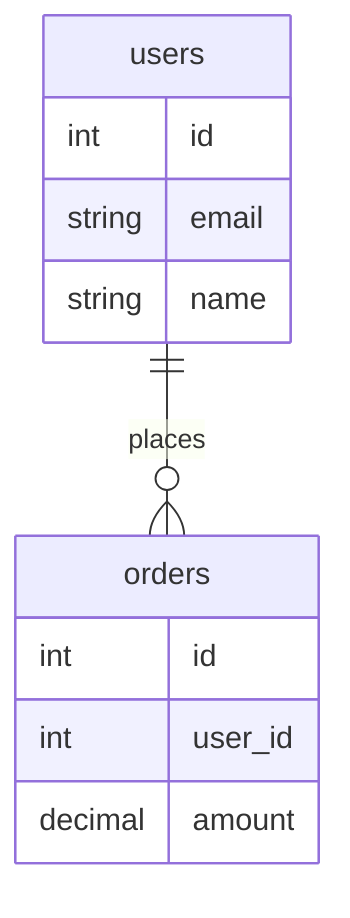

#  SchemaIntelligence: AI-Powered PostgreSQL MCP Server

> Transforms PostgreSQL databases from "I have tables and I don't know what they do" into "I understand the entire database structure, relationships, and best practices"

##  Overview

**SchemaIntelligence** is an MCP (Model Context Protocol) server that provides intelligent analysis, documentation, and complete CRUD operations for PostgreSQL databases. It combines deterministic schema extraction with AI-powered reasoning and 20 secure data manipulation operations to help users and AI agents understand and interact with complex database structures.

###  Key Features

- **Schema Extraction**: Automatically extract tables, columns, relationships, and constraints
- **Intelligent Analysis**: Detect junction tables, implicit relationships, and suggest optimal joins
- **AI-Powered Insights**: Leverage Ollama/LLM to generate business explanations and recommendations
- **Complete CRUD Operations**: 20 data manipulation operations with SQL injection prevention
- **Multiple Output Formats**:
  - Mermaid ER diagrams (with SVG rendering)
  - Mermaid relationship flowcharts (with SVG rendering)
  - Comprehensive Markdown documentation
  - Visual diagram files (SVG, PNG, PDF)
- **Query Assistance**: Smart join type recommendations (INNER vs LEFT)
- **Modular Architecture**: Clean, extensible design for easy feature additions
- **Diagram Rendering**: Auto-generate visual database structure diagrams
- **Security**: Parameterized queries, input validation, SQL injection prevention

---

##  Project Structure

```
PostgreSQL-MCP/
├── src/
│   ├── __init__.py               # Package initialization
│   ├── config.py                 # Configuration management (DB, Ollama, App)
│   ├── database/
│   │   ├── __init__.py
│   │   └── connection.py         # PostgreSQL connection utilities
│   ├── schema/
│   │   ├── __init__.py
│   │   └── extractor.py          # Schema extraction logic
│   ├── analysis/
│   │   ├── __init__.py
│   │   └── detector.py           # Junction table & relationship detection
│   ├── generation/
│   │   ├── __init__.py
│   │   ├── mermaid_gen.py        # ER diagram generation
│   │   ├── markdown_gen.py       # Documentation generation
│   │   └── diagram_renderer.py   # SVG diagram rendering
│   ├── llm/
│   │   ├── __init__.py
│   │   └── ollama_client.py      # Ollama/LLM integration
│   └── crud/
│       ├── __init__.py           # CRUD operations export
│       ├── crud_manager.py       # Core CRUD operations (20 operations)
│       └── crud_validator.py     # Input validation & security
├── postgresql_server.py          # MCP server with all tools exposed
├── client.py                     # MCP client for testing
├── main.py                       # Entry point placeholder
├── pyproject.toml               # Python project configuration
├── .env                         # Environment variables (not in repo)
└── README.md                    # This file
```

###  Module Breakdown

#### `config.py`
Centralized configuration for:
- **DatabaseConfig**: PostgreSQL connection parameters
- **OllamaConfig**: LLM (Ollama) settings
- **AppConfig**: Application-level settings (logging, debug mode)

#### `src/database/connection.py`
- `get_connection()`: Create PostgreSQL connections with pooling
- Connection error handling and timeout management

#### `src/schema/extractor.py`
- `extract_schema()`: Full schema extraction
- `get_table_info()`: Single table details
- `get_tables_list()`: List all tables
- Handles all information_schema queries

#### `src/analysis/detector.py`
- `detect_junction_tables()`: Find many-to-many association tables
- `suggest_joins()`: Recommend JOIN types based on nullability
- `detect_implicit_relationships()`: Find potential undeclared FKs (*_id columns)

#### `src/crud/crud_manager.py`
Core CRUD operations (20 total):
- **Create**: Insert records, batch operations, create tables/views/indexes
- **Read**: Query data, get records with filters, count, distinct values, pagination
- **Update**: Update records, batch updates, rename tables/columns
- **Delete**: Delete records, truncate, drop tables
- All operations use parameterized queries to prevent SQL injection

#### `src/crud/crud_validator.py`
Security and validation layer:
- `validate_table_name()`: Identifier format and reserved keyword checking
- `validate_column_name()`: Column name validation
- `validate_column_type()`: PostgreSQL data type validation
- `validate_where_clause()`: SQL injection pattern detection
- `validate_values_dict()`: Data structure validation
- `validate_primary_key()`: Primary key constraint validation
- `validate_foreign_key()`: Foreign key relationship validation

#### `src/generation/mermaid_gen.py`
- `generate_mermaid_erd()`: Entity-Relationship Diagram in Mermaid syntax
- `generate_mermaid_flowchart()`: Relationship flowchart visualization
- Supports table relationships, constraints, and cardinality

#### `src/generation/diagram_renderer.py`
- `render_database_diagrams()`: Convert Mermaid diagrams to visual formats
- SVG rendering (recommended for API usage)
- PNG/PDF support (requires mermaid-cli)

#### `src/generation/markdown_gen.py`
- `generate_markdown()`: Full database documentation in Markdown
- `generate_table_documentation()`: Single table documentation
- Includes schema details, relationships, and constraints

#### `src/llm/ollama_client.py`
- `OllamaAnalyzer`: Interface to Ollama LLM for AI analysis
- `explain_schema()`: Get business-level database analysis
- `get_available_models()`: List deployed LLM models
- `is_available()`: Check Ollama service status

---

##  Getting Started

### Prerequisites
- Python 3.11+
- PostgreSQL database
- Ollama server (optional, for AI explanations)
- `uv` package manager

### Installation

1. **Clone repository and install dependencies:**
   ```bash
   cd SchemaIntelligence
   uv pip install -e .
   ```

2. **Set environment variables** (create `.env`):
   ```env
   # PostgreSQL
   DB_HOST=localhost
   DB_PORT=5432
   DB_NAME=your_database
   DB_USER=postgres
   DB_PASSWORD=your_password

   # Ollama/LLM
   OLLAMA_BASE_URL=http://192.168.1.143:11434
   OLLAMA_MODEL=deepseek-r1:14b

   # App
   DEBUG=False
   ```

### Running the Server

```bash
# Start MCP server
uv run postgresql_server.py

# In another terminal, run client
uv run client.py postgresql_server.py
```

---

##  Available MCP Tools

### Schema Analysis Tools

#### 1. `analyze_database()`
Comprehensive schema analysis without LLM.
- Full schema structure
- Junction tables detected
- Implicit relationships
- Join suggestions
- Mermaid ER diagram
- Markdown documentation

#### 2. `explain_database()`
AI-powered database analysis using Ollama.
- Business explanation of database purpose
- Detected relationships and join recommendations
- Improved Mermaid ERD with insights
- Quality recommendations

#### 3. `get_table_details(table_name: str)`
Detailed analysis of a specific table.
- Table structure and relationships
- Column information
- Table-specific documentation

#### 4. `list_tables()`
Get all tables in database.
- List of table names and total count

#### 5. `check_ollama_status()`
Verify Ollama/LLM availability.
- Service status and available models
- Configured model status

#### 6. `render_database_diagrams(output_format: str = "svg")`
Generate visual database structure diagrams.
- ER Diagram (erd_svg.svg)
- Flowchart (flowchart_svg.svg)
- SVG files in `diagrams/` directory

---

### CRUD Operations (Phase 1)

#### Create Operations
- **`crud_create_record(table_name, values)`** - Insert single record with validation
- **`crud_create_records_batch(table_name, records)`** - Batch insert multiple records
- **`crud_create_table(table_name, columns, primary_key)`** - Create table with columns and constraints
- **`crud_create_view(view_name, select_query, replace_if_exists)`** - Create database views
- **`crud_create_index(index_name, table_name, columns, unique)`** - Create indexes (optional unique constraint)

#### Read Operations
- **`crud_query_data(query, params, limit, offset)`** - Execute SELECT with parameterization
- **`crud_get_records(table_name, where_clause, order_by, limit, offset)`** - Filtered record retrieval
- **`crud_get_record_count(table_name, where_clause)`** - Count records matching condition
- **`crud_distinct_values(table_name, column_name, limit)`** - Get unique column values
- **`crud_paginate_data(table_name, page, page_size, order_by, where_clause)`** - Paginated results with metadata

#### Update Operations
- **`crud_update_record(table_name, record_id, id_column, values)`** - Update single record by ID
- **`crud_update_records_batch(table_name, where_clause, values)`** - Batch update matching records
- **`crud_update_column(table_name, column_name, new_value, where_clause)`** - Bulk column value update
- **`crud_rename_table(old_name, new_name)`** - Rename table safely
- **`crud_rename_column(table_name, old_column, new_column)`** - Rename column with dependency checks

#### Delete Operations
- **`crud_delete_record(table_name, record_id, id_column)`** - Delete single record by ID
- **`crud_delete_records(table_name, where_clause)`** - Delete multiple records matching condition
- **`crud_truncate_table(table_name)`** - Clear all data from table (fast operation)
- **`crud_drop_table(table_name, cascade)`** - Drop table with optional CASCADE

**Security Features:**
- ✅ Parameterized queries (prevents SQL injection)
- ✅ Input validation (table/column name validation)
- ✅ Constraint checking (validates data types and constraints)
- ✅ Standardized response format with status and duration

---

##  Output Examples

### Mermaid ER Diagram


### Join Recommendations
```json
{
  "left_table": "orders",
  "right_table": "users",
  "join_condition": "orders.user_id = users.id",
  "join_type": "INNER JOIN"
}
```

---

##  Workflow Examples

### Example 1: Analyze a Database

```
Query: "Analyze my database"
→ analyze_database() tool called
→ Returns: schema, junction tables, joins, ERD, docs
```

### Example 2: Get AI Explanation

```
Query: "Explain what this database does"
→ analyze_database() + explain_database() tools
→ Ollama LLM analyzes schema
```

### Example 3: Create a Table

```
Query: "Create a table called 'products' with id (INTEGER primary key), name (VARCHAR 255), and price (DECIMAL 10,2)"
→ crud_create_table() tool called
→ Table created with specified columns and constraints
```

### Example 4: Insert and Query Data

```
Query: "Insert a product record: name='Laptop', price=999.99 into products table"
→ crud_create_record() tool called
→ Record inserted with validation

Query: "Get all products with price > 500 ordered by price descending, limit 10"
→ crud_get_records() tool called
→ Returns filtered, sorted records
```

### Example 5: Update Data

```
Query: "Update product id=1, set price to 899.99"
→ crud_update_record() tool called
→ Record updated safely with parameterized query
```

### Example 6: Data Analysis

```
Query: "Count how many products are in the database"
→ crud_get_record_count() tool called
→ Returns total count

Query: "Get distinct product prices"
→ crud_distinct_values() tool called
→ Returns unique values
```

---

##  Phase 2: Schema Modification (In Progress)

Advanced schema operations for database evolution:

### Column Management
- Add/modify/drop columns with types and constraints
- Set nullable/not-null constraints
- Add default values
- Column documentation and comments

### Index Operations
- List and analyze indexes
- Create/drop indexes safely
- Rebuild fragmented indexes
- Check index usage

### Constraint Operations
- Add/drop primary keys, foreign keys, unique constraints
- Add check constraints with validation
- List all constraints by type
- Manage cascade rules for dependencies

### View Management
- List and drop views
- Get view definitions
- Drop with cascade options

---

## 🔌 Extensibility

### Adding a New Analysis Tool

1. Create function in appropriate `src/` module
2. Import in `postgresql_server.py`
3. Wrap with `@mcp.tool()` decorator

```python
# Example: src/analysis/new_analyzer.py
def analyze_query_patterns(schema: Dict) -> Dict:
    """Analyze schema for query optimization opportunities"""
    return {"patterns": [...]}

# In postgresql_server.py
from src.analysis.new_analyzer import analyze_query_patterns

@mcp.tool()
def get_query_optimization_tips() -> Dict:
    schema = extract_schema()
    return analyze_query_patterns(schema)
```

### Using Different LLM Providers

1. Extend `src/llm/ollama_client.py` or create `src/llm/openai_client.py`
2. Implement same interface as `OllamaAnalyzer`
3. Update imports in `postgresql_server.py`


---

##  Resources

- [PostgreSQL Information Schema](https://www.postgresql.org/docs/current/information-schema.html)
- [Mermaid ER Diagrams](https://mermaid.js.org/syntax/entityRelationshipDiagram.html)
- [Model Context Protocol](https://modelcontextprotocol.io/)
- [Ollama Documentation](https://ollama.com/docs)

---

## 🤝 Contributing

This project is OpenSource. Contributions are welcome

---
