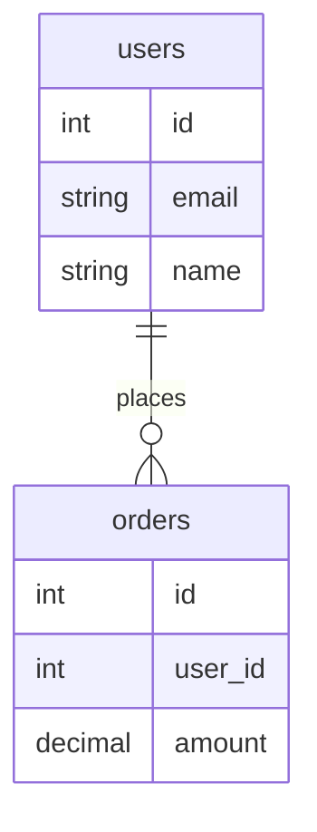

#  SchemaIntelligence: AI-Powered PostgreSQL MCP Server

> Transforms PostgreSQL databases from "I have tables and I don't know what they do" into "I understand the entire database structure, relationships, and best practices"

##  Overview

**SchemaIntelligence** is an MCP (Model Context Protocol) server that provides intelligent analysis and documentation of PostgreSQL databases. It combines deterministic schema extraction with AI-powered reasoning to help users and AI agents understand complex database structures.

###  Key Features

- **Schema Extraction**: Automatically extract tables, columns, relationships, and constraints
- **Intelligent Analysis**: Detect junction tables, implicit relationships, and suggest optimal joins
- **AI-Powered Insights**: Leverage Ollama/LLM to generate business explanations and recommendations
- **Multiple Output Formats**:
  - Mermaid ER diagrams (with SVG rendering)
  - Mermaid relationship flowcharts (with SVG rendering)
  - Comprehensive Markdown documentation
  - Visual diagram files (SVG, PNG, PDF)
- **Query Assistance**: Smart join type recommendations (INNER vs LEFT)
- **Modular Architecture**: Clean, extensible design for easy feature additions
- **Diagram Rendering**: Auto-generate visual database structure diagrams

---

##  Project Structure

```
SchemaIntelligence/
├── src/
│   ├── __init__.py               # Package initialization
│   ├── config.py                 # Configuration management (DB, Ollama, App)
│   ├── database/
│   │   ├── __init__.py
│   │   └── connection.py         # PostgreSQL connection utilities
│   ├── schema/
│   │   ├── __init__.py
│   │   └── extractor.py          # Schema extraction logic
│   ├── analysis/
│   │   ├── __init__.py
│   │   └── detector.py           # Junction table & relationship detection
│   ├── generation/
│   │   ├── __init__.py
│   │   ├── mermaid_gen.py        # ER diagram generation
│   │   └── markdown_gen.py       # Documentation generation
│   └── llm/
│       ├── __init__.py
│       └── ollama_client.py      # Ollama/LLM integration
├── postgresql_server.py          # MCP server with exposed tools
├── main.py                       # Entry point placeholder
├── pyproject.toml               # Python project configuration
└── README.md                    # This file
```

###  Module Breakdown

#### `config.py`
Centralized configuration for:
- **DatabaseConfig**: PostgreSQL connection parameters
- **OllamaConfig**: LLM (Ollama) settings
- **AppConfig**: Application-level settings (logging, debug mode)

#### `src/database/connection.py`
- `get_connection()`: Create PostgreSQL connections
- Handles connection pooling and error handling

#### `src/schema/extractor.py`
- `extract_schema()`: Full schema extraction
- `get_table_info()`: Single table details
- `get_tables_list()`: List all tables
- Handles all information_schema queries

#### `src/analysis/detector.py`
- `detect_junction_tables()`: Find many-to-many association tables
- `suggest_joins()`: Recommend JOIN types based on nullability
- `detect_implicit_relationships()`: Find potential undeclared FKs (*_id columns)

#### `src/generation/mermaid_gen.py`
- `generate_mermaid_erd()`: Entity-Relationship Diagram in Mermaid
- `generate_mermaid_flowchart()`: Relationship flowchart visualization

#### `src/generation/markdown_gen.py`
- `generate_markdown()`: Full database documentation
- `generate_table_documentation()`: Single table documentation

#### `src/llm/ollama_client.py`
- `OllamaAnalyzer`: Interface to Ollama LLM
- `explain_schema()`: Get AI analysis of database
- `get_available_models()`: List available models
- `is_available()`: Check model availability

---

##  Getting Started

### Prerequisites
- Python 3.11+
- PostgreSQL database
- Ollama server (optional, for AI explanations)
- `uv` package manager

### Installation

1. **Clone repository and install dependencies:**
   ```bash
   cd SchemaIntelligence
   uv pip install -e .
   ```

2. **Set environment variables** (create `.env`):
   ```env
   # PostgreSQL
   DB_HOST=localhost
   DB_PORT=5432
   DB_NAME=your_database
   DB_USER=postgres
   DB_PASSWORD=your_password

   # Ollama/LLM
   OLLAMA_BASE_URL=http://192.168.1.143:11434
   OLLAMA_MODEL=deepseek-r1:14b

   # App
   DEBUG=False
   ```

### Running the Server

```bash
# Start MCP server
uv run postgresql_server.py

# In another terminal, run client
uv run client.py postgresql_server.py
```

---

##  Available MCP Tools

### 1. `analyze_database()`
Comprehensive schema analysis without LLM.

**Returns:**
- Full schema structure
- Junction tables detected
- Implicit relationships
- Join suggestions
- Mermaid ER diagram
- Markdown documentation

### 2. `explain_database()`
AI-powered analysis using Ollama.

**Returns:**
- Business explanation of database purpose
- Detected relationships
- Join recommendations
- Improved Mermaid ERD
- Quality insights

### 3. `get_table_details(table_name: str)`
Detailed analysis of a specific table.

**Returns:**
- Table structure
- Relationships
- Table-specific documentation

### 4. `list_tables()`
Get all tables in database.

**Returns:**
- List of table names
- Total count

### 5. `check_ollama_status()`
Verify Ollama/LLM availability.

**Returns:**
- Service status
- Available models
- Configured model status

### 6. `render_database_diagrams(output_format: str = "svg")`
Generate visual diagram files of database structure.

**Generates:**
- **ER Diagram (erd_svg.svg)**: Complete entity-relationship diagram with all tables, columns, and relationships
- **Flowchart (flowchart_svg.svg)**: Table relationship flowchart showing data flow

**Returns:**
- Paths to generated SVG files in `diagrams/` directory
- File sizes and status information

**Examples:**
```
# Generate default SVG diagrams
render_database_diagrams()

# Render as SVG (recommended for API, may fall back to mermaid-cli if available)
render_database_diagrams(output_format="svg")
```

**Note:** SVG format is recommended for optimal compatibility. PNG/PDF formats require mermaid-cli to be installed locally.

---

##  Output Examples

### Mermaid ER Diagram


### Join Recommendations
```json
{
  "left_table": "orders",
  "right_table": "users",
  "join_condition": "orders.user_id = users.id",
  "join_type": "INNER JOIN"
}
```

---

##  Workflow Examples

### Example 1: Analyze a Database

```
Query: "Analyze my database"
→ analyze_database() tool called
→ Returns: schema, junction tables, joins, ERD, docs
→ User sees: complete database structure
```

### Example 2: Get AI Explanation

```
Query: "Explain what this database does"
→ analyze_database() + explain_database() tools
→ Ollama LLM analyzes schema
→ Returns: business purpose, relationships, insights
```

### Example 3: Explore Specific Table

```
Query: "Tell me about the orders table"
→ get_table_details("orders") tool called
→ Returns: columns, relationships, documentation
```

---

## 🔌 Extensibility

### Adding a New Analysis Tool

1. Create function in appropriate `src/` module
2. Import in `postgresql_server.py`
3. Wrap with `@mcp.tool()` decorator

```python
# Example: src/analysis/new_analyzer.py
def analyze_query_patterns(schema: Dict) -> Dict:
    """Analyze schema for query optimization opportunities"""
    return {"patterns": [...]}

# In postgresql_server.py
from src.analysis.new_analyzer import analyze_query_patterns

@mcp.tool()
def get_query_optimization_tips() -> Dict:
    schema = extract_schema()
    return analyze_query_patterns(schema)
```

### Using Different LLM Providers

1. Extend `src/llm/ollama_client.py` or create `src/llm/openai_client.py`
2. Implement same interface as `OllamaAnalyzer`
3. Update imports in `postgresql_server.py`


---

##  Resources

- [PostgreSQL Information Schema](https://www.postgresql.org/docs/current/information-schema.html)
- [Mermaid ER Diagrams](https://mermaid.js.org/syntax/entityRelationshipDiagram.html)
- [Model Context Protocol](https://modelcontextprotocol.io/)
- [Ollama Documentation](https://ollama.com/docs)

---

## 🤝 Contributing

This project is OpenSource. Contributions are welcome

---
