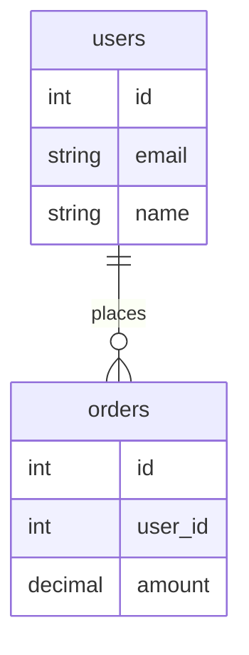

#  SchemaIntelligence: AI-Powered PostgreSQL MCP Server (Optimized Edition)

> Transforms PostgreSQL databases from "I have tables and I don't know what they do" into "I understand the entire database structure, relationships, and best practices"

##  Overview

**SchemaIntelligence** is an MCP (Model Context Protocol) server that provides intelligent analysis, documentation, and complete CRUD operations for PostgreSQL databases. It combines deterministic schema extraction with AI-powered reasoning and secure data manipulation operations to help users and AI agents understand and interact with complex database structures.

**⚡ Performance Optimized:** Reduced from 38 tools to 19 consolidated tools (~50% reduction) for significant token savings and faster agent decision-making while maintaining full functionality.

###  Key Features

- **🎯 Token-Optimized**: 19 consolidated tools (down from 38) = ~50% lower context overhead
- **Schema Extraction**: Automatically extract tables, columns, relationships, and constraints
- **Intelligent Analysis**: Detect junction tables, implicit relationships, and suggest optimal joins
- **AI-Powered Insights**: Leverage Ollama/LLM to generate business explanations and recommendations
- **Complete CRUD Operations**: Unified tools for all data manipulation with SQL injection prevention
- **Multiple Output Formats**:
  - Mermaid ER diagrams (with SVG rendering)
  - Mermaid relationship flowcharts (with SVG rendering)
  - Comprehensive Markdown documentation
  - Visual diagram files (SVG, PNG, PDF)
- **Query Assistance**: Smart join type recommendations (INNER vs LEFT)
- **Modular Architecture**: Clean, extensible design for easy feature additions
- **Diagram Rendering**: Auto-generate visual database structure diagrams
- **Security**: Parameterized queries, input validation, SQL injection prevention

### 💡 Optimization Benefits

**Why Consolidation Matters:**
- **Lower Token Usage**: Fewer tool descriptions in agent context = reduced costs per request
- **Faster Responses**: Agents make decisions quicker with fewer options to evaluate
- **Better UX**: Cleaner API with related operations logically grouped
- **Easier Maintenance**: Less code duplication, single source of truth for operations
- **Backward Compatible**: All original functionality preserved through unified interfaces

---

##  Project Structure

```
PostgreSQL-MCP/
├── src/
│   ├── __init__.py               # Package initialization
│   ├── config.py                 # Configuration management (DB, Ollama, App)
│   ├── database/
│   │   ├── __init__.py
│   │   └── connection.py         # PostgreSQL connection utilities
│   ├── schema/
│   │   ├── __init__.py
│   │   └── extractor.py          # Schema extraction logic
│   ├── analysis/
│   │   ├── __init__.py
│   │   └── detector.py           # Junction table & relationship detection
│   ├── generation/
│   │   ├── __init__.py
│   │   ├── mermaid_gen.py        # ER diagram generation
│   │   ├── markdown_gen.py       # Documentation generation
│   │   └── diagram_renderer.py   # SVG diagram rendering
│   ├── llm/
│   │   ├── __init__.py
│   │   └── ollama_client.py      # Ollama/LLM integration
│   └── crud/
│       ├── __init__.py           # CRUD operations export
│       ├── crud_manager.py       # Core CRUD operations (20 operations)
│       └── crud_validator.py     # Input validation & security
├── postgresql_server.py          # MCP server with all tools exposed
├── client.py                     # MCP client for testing
├── main.py                       # Entry point placeholder
├── pyproject.toml               # Python project configuration
├── .env                         # Environment variables (not in repo)
└── README.md                    # This file
```

###  Module Breakdown

#### `config.py`
Centralized configuration for:
- **DatabaseConfig**: PostgreSQL connection parameters
- **OllamaConfig**: LLM (Ollama) settings
- **AppConfig**: Application-level settings (logging, debug mode)

#### `src/database/connection.py`
- `get_connection()`: Create PostgreSQL connections with pooling
- Connection error handling and timeout management

#### `src/schema/extractor.py`
- `extract_schema()`: Full schema extraction
- `get_table_info()`: Single table details
- `get_tables_list()`: List all tables
- Handles all information_schema queries

#### `src/analysis/detector.py`
- `detect_junction_tables()`: Find many-to-many association tables
- `suggest_joins()`: Recommend JOIN types based on nullability
- `detect_implicit_relationships()`: Find potential undeclared FKs (*_id columns)

#### `src/crud/crud_manager.py`
Core CRUD operations (20 total):
- **Create**: Insert records, batch operations, create tables/views/indexes
- **Read**: Query data, get records with filters, count, distinct values, pagination
- **Update**: Update records, batch updates, rename tables/columns
- **Delete**: Delete records, truncate, drop tables
- All operations use parameterized queries to prevent SQL injection

#### `src/crud/crud_validator.py`
Security and validation layer:
- `validate_table_name()`: Identifier format and reserved keyword checking
- `validate_column_name()`: Column name validation
- `validate_column_type()`: PostgreSQL data type validation
- `validate_where_clause()`: SQL injection pattern detection
- `validate_values_dict()`: Data structure validation
- `validate_primary_key()`: Primary key constraint validation
- `validate_foreign_key()`: Foreign key relationship validation

#### `src/generation/mermaid_gen.py`
- `generate_mermaid_erd()`: Entity-Relationship Diagram in Mermaid syntax
- `generate_mermaid_flowchart()`: Relationship flowchart visualization
- Supports table relationships, constraints, and cardinality

#### `src/generation/diagram_renderer.py`
- `render_database_diagrams()`: Convert Mermaid diagrams to visual formats
- SVG rendering (recommended for API usage)
- PNG/PDF support (requires mermaid-cli)

#### `src/generation/markdown_gen.py`
- `generate_markdown()`: Full database documentation in Markdown
- `generate_table_documentation()`: Single table documentation
- Includes schema details, relationships, and constraints

#### `src/llm/ollama_client.py`
- `OllamaAnalyzer`: Interface to Ollama LLM for AI analysis
- `explain_schema()`: Get business-level database analysis
- `get_available_models()`: List deployed LLM models
- `is_available()`: Check Ollama service status

---

##  Getting Started

### Prerequisites
- Python 3.11+
- PostgreSQL database
- Ollama server (optional, for AI explanations)
- `uv` package manager

### Installation

1. **Clone repository and install dependencies:**
   ```bash
   cd SchemaIntelligence
   uv pip install -e .
   ```

2. **Set environment variables** (create `.env`):
   ```env
   # PostgreSQL
   DB_HOST=localhost
   DB_PORT=5432
   DB_NAME=your_database
   DB_USER=postgres
   DB_PASSWORD=your_password

   # Ollama/LLM
   OLLAMA_BASE_URL=http://192.168.1.143:11434
   OLLAMA_MODEL=deepseek-r1:14b

   # App
   DEBUG=False
   ```

### Running the Server

```bash
# Start MCP server
uv run postgresql_server.py

# In another terminal, run client
uv run client.py postgresql_server.py
```

---

##  Available MCP Tools (19 Total - Optimized)

### 📊 Category 1: Analysis & Schema Tools (5 tools)

#### 1. `analyze_database()`
Comprehensive schema analysis without LLM.
- Full schema structure (tables, columns, keys, data types)
- Junction tables detected
- Implicit relationships discovered
- Join suggestions (INNER vs LEFT)
- Mermaid ER diagram
- Mermaid relationship flowchart
- Comprehensive Markdown documentation

#### 2. `explain_database()`
AI-powered database analysis using Ollama LLM.
- Business explanation of database purpose
- Detected relationships and join recommendations
- Improved Mermaid ERD with AI insights
- Database quality recommendations

#### 3. `get_table_details(table_name: str)`
Detailed analysis of a specific table.
- Table structure and relationships
- Column information and constraints
- Table-specific Markdown documentation

#### 4. `get_database_info(info_type: str = "tables")`
**NEW: Unified info retrieval tool** - Consolidates list_tables, check_ollama_status
- `info_type="tables"`: List all tables with count
- `info_type="ollama"`: Check Ollama/LLM service status and available models
- `info_type="summary"`: Quick database statistics

#### 5. `render_database_diagrams(output_format: str = "svg")`
Generate visual database structure diagrams.
- ER Diagram (erd_svg.svg)
- Flowchart (flowchart_svg.svg)
- SVG/PNG/PDF files in `diagrams/` directory

---

### ✨ Category 2: CRUD Create Operations (4 tools)

#### 6. `crud_insert(table_name: str, data: Dict | List[Dict])`
**NEW: Smart insert** - Consolidates single and batch inserts
- **Single insert**: Pass Dict → `{"name": "John", "age": 30}`
- **Batch insert**: Pass List[Dict] → `[{"name": "John"}, {"name": "Jane"}]`
- Automatic detection of single vs batch mode
- Parameterized queries for SQL injection prevention

#### 7. `crud_create_table(table_name, columns, primary_key)`
Create a new table with columns and constraints.
- Define columns with types: `{"name": "id", "type": "INTEGER", "nullable": False}`
- Optional primary key specification
- Full constraint support

#### 8. `crud_create_view(view_name, select_query, replace_if_exists)`
Create database views from SELECT queries.
- Define virtual tables
- Optional view replacement

#### 9. `crud_create_index(index_name, table_name, columns, unique)`
Create single or composite indexes.
- Single column: `columns=["email"]`
- Composite: `columns=["last_name", "first_name"]`
- Optional UNIQUE constraint

---

### 🔍 Category 3: CRUD Read Operations (2 tools)

#### 10. `crud_query(query, params, limit, offset)`
**NEW: Raw SQL query execution** - For complex queries with JOINs and aggregations
- Execute any SELECT statement
- Parameterized values: Use `%s` placeholders
- Pagination support with limit/offset
- Example: `query="SELECT * FROM users WHERE age > %s", params=[30]`

#### 11. `crud_get(table_name, mode, where_clause, where_params, options)`
**NEW: Unified high-level read** - Consolidates 4 read operations
- `mode="records"`: Get filtered records (replaces crud_get_records)
- `mode="count"`: Count records (replaces crud_get_record_count)
- `mode="distinct"`: Get distinct values (replaces crud_distinct_values)
- `mode="paginate"`: Paginated results with metadata (replaces crud_paginate_data)
- Full WHERE clause, ordering, and filter support

---

### ✏️ Category 4: CRUD Update Operations (2 tools)

#### 12. `crud_update(table_name, values, where_clause, where_params, id_column, record_id)`
**NEW: Unified update** - Consolidates single, batch, and column updates
- **Single record**: Provide `record_id` + `id_column`
- **Batch update**: Provide `where_clause` + `where_params`
- **Column update**: Single key-value in `values` dict
- Parameterized queries for security

#### 13. `crud_rename(object_type, old_name, new_name, table_name)`
**NEW: Rename anything** - Consolidates table and column rename
- `object_type="table"`: Rename table
- `object_type="column"`: Rename column (requires `table_name`)
- Safe renaming with validation

---

### 🗑️ Category 5: CRUD Delete Operations (1 tool)

#### 14. `crud_delete(table_name, mode, where_clause, where_params, id_column, record_id, cascade)`
**NEW: Unified deletion** - Consolidates 4 delete operations
- `mode="records"`: Delete specific records (single or batch)
  - Single: Provide `record_id` + `id_column`
  - Batch: Provide `where_clause` + `where_params`
- `mode="truncate"`: Clear all data (fast, resets sequences)
- `mode="drop"`: Drop entire table (WARNING: destroys structure)
- Optional `cascade` for dependent objects

---

### 🔧 Category 6: Schema Modification (5 tools)

#### 15. `mod_column(table_name, action, column_name, column_spec, cascade)`
**NEW: Unified column management** - Consolidates 4 column operations
- `action="add"`: Add new column → `column_spec={"name": "status", "type": "VARCHAR(50)"}`
- `action="modify_type"`: Change data type → `column_spec={"new_type": "TEXT"}`
- `action="drop"`: Remove column
- `action="set_nullable"`: Toggle NULL constraint → `column_spec={"is_nullable": True}`

#### 16. `mod_index(action, index_name, table_name, cascade)`
**NEW: Index management** - Consolidates list and drop operations
- `action="list"`: List all indexes (optionally filtered by table)
- `action="drop"`: Drop index with optional cascade

#### 17. `mod_constraint(action, table_name, constraint_name, cascade)`
**NEW: Constraint management** - Consolidates list and drop operations
- `action="list"`: List all constraints (PK, FK, unique, check)
- `action="drop"`: Drop constraint with optional cascade

#### 18. `mod_add_constraint(constraint_type, table_name, spec)`
**NEW: Add constraints** - Consolidates primary key and foreign key addition
- `constraint_type="primary_key"` + `spec={"columns": ["id"]}`
- `constraint_type="foreign_key"` + `spec={"columns": ["user_id"], "ref_table": "users", "ref_columns": ["id"], "on_delete": "CASCADE"}`

#### 19. `mod_view(action, view_name, cascade)`
**NEW: View management** - Consolidates 3 view operations
- `action="list"`: List all views
- `action="get"`: Get view SQL definition
- `action="drop"`: Drop view with optional cascade

---

## 📊 Tool Consolidation Summary

| Category | Before | After | Reduction |
|----------|--------|-------|-----------|
| Analysis & Schema | 6 | 5 | -1 (17%) |
| CRUD Create | 5 | 4 | -1 (20%) |
| CRUD Read | 5 | 2 | -3 (60%) |
| CRUD Update | 5 | 2 | -3 (60%) |
| CRUD Delete | 4 | 1 | -3 (75%) |
| Schema Modification | 13 | 5 | -8 (62%) |
| **TOTAL** | **38** | **19** | **-19 (50%)** |

**Result:** Exactly 50% reduction in tool count = ~50% lower token overhead for AI agents

---

**Security Features (All Operations):**
- ✅ Parameterized queries (prevents SQL injection)
- ✅ Input validation (table/column name validation)
- ✅ Constraint checking (validates data types and constraints)
- ✅ Standardized response format with status and duration

---

##  Output Examples

### Mermaid ER Diagram

```mermaid
erDiagram
  users {
    int id
    string email
    string name
  }
  orders {
    int id
    int user_id
    decimal amount
  }
  users ||--o{ orders : places
```

### Join Recommendations
```json
{
  "left_table": "orders",
  "right_table": "users",
  "join_condition": "orders.user_id = users.id",
  "join_type": "INNER JOIN"
}
```

---

##  Usage Examples with New Consolidated Tools

### Example 1: Analyze a Database

```
Query: "Analyze my database"
→ analyze_database() tool called
→ Returns: schema, junction tables, joins, ERD, flowchart, docs
```

### Example 2: Get AI Explanation

```
Query: "Explain what this database does"
→ analyze_database() + explain_database() tools
→ Ollama LLM analyzes schema
```

### Example 3: List All Tables

```
Query: "Show me all tables in the database"
→ get_database_info(info_type="tables") tool called
→ Returns list of tables with count
```

### Example 4: Create and Populate a Table

```
Query: "Create a table called 'products' with id (INTEGER primary key), name (VARCHAR 255), and price (DECIMAL 10,2)"
→ crud_create_table() tool called
→ Table created with specified columns and constraints

Query: "Insert product records: name='Laptop', price=999.99 and name='Mouse', price=29.99"
→ crud_insert(data=[{"name": "Laptop", "price": 999.99}, {"name": "Mouse", "price": 29.99}])
→ Batch insert executed
```

### Example 5: Query Data (Multiple Modes)

```
Query: "Get all products with price > 500 ordered by price descending, limit 10"
→ crud_get(table_name="products", mode="records", where_clause="price > %s", 
           where_params=[500], options={"limit": 10, "order_by": "price DESC"})
→ Returns filtered, sorted records

Query: "Count how many products cost more than 100"
→ crud_get(table_name="products", mode="count", where_clause="price > %s", where_params=[100])
→ Returns count

Query: "Show me all distinct product prices"
→ crud_get(table_name="products", mode="distinct", options={"column_name": "price"})
→ Returns unique values
```

### Example 6: Update Records

```
Query: "Update product id=1, set price to 899.99"
→ crud_update(table_name="products", values={"price": 899.99}, record_id=1, id_column="id")
→ Single record updated

Query: "Set all products with price < 50 to status 'cheap'"
→ crud_update(table_name="products", values={"status": "cheap"}, 
              where_clause="price < %s", where_params=[50])
→ Batch update executed
```

### Example 7: Schema Modifications

```
Query: "Add a 'discount' column to products table (DECIMAL 5,2)"
→ mod_column(table_name="products", action="add", 
             column_spec={"name": "discount", "type": "DECIMAL(5,2)", "nullable": True})
→ Column added

Query: "Show me all indexes on the products table"
→ mod_index(action="list", table_name="products")
→ Returns list of indexes

Query: "Add a foreign key: orders.product_id references products.id"
→ mod_add_constraint(constraint_type="foreign_key", table_name="orders",
                     spec={"columns": ["product_id"], "ref_table": "products", 
                           "ref_columns": ["id"], "on_delete": "CASCADE"})
→ Foreign key constraint added
```

### Example 8: Delete Operations

```
Query: "Delete product with id=5"
→ crud_delete(table_name="products", mode="records", record_id=5, id_column="id")
→ Single record deleted

Query: "Delete all products where price is null"
→ crud_delete(table_name="products", mode="records", 
              where_clause="price IS NULL", where_params=[])
→ Batch deletion executed

Query: "Clear all data from the products table"
→ crud_delete(table_name="products", mode="truncate")
→ Table truncated (fast operation)
```

---

## 🔌 Extensibility

### Adding a New Analysis Tool

1. Create function in appropriate `src/` module
2. Import in `postgresql_server.py`
3. Wrap with `@mcp.tool()` decorator

```python
# Example: src/analysis/new_analyzer.py
def analyze_query_patterns(schema: Dict) -> Dict:
    """Analyze schema for query optimization opportunities"""
    return {"patterns": [...]}

# In postgresql_server.py
from src.analysis.new_analyzer import analyze_query_patterns

@mcp.tool()
def get_query_optimization_tips() -> Dict:
    schema = extract_schema()
    return analyze_query_patterns(schema)
```

### Using Different LLM Providers

1. Extend `src/llm/ollama_client.py` or create `src/llm/openai_client.py`
2. Implement same interface as `OllamaAnalyzer`
3. Update imports in `postgresql_server.py`


---

##  Resources

- [PostgreSQL Information Schema](https://www.postgresql.org/docs/current/information-schema.html)
- [Mermaid ER Diagrams](https://mermaid.js.org/syntax/entityRelationshipDiagram.html)
- [Model Context Protocol](https://modelcontextprotocol.io/)
- [Ollama Documentation](https://ollama.com/docs)

---

## 🤝 Contributing

This project is OpenSource. Contributions are welcome

---
