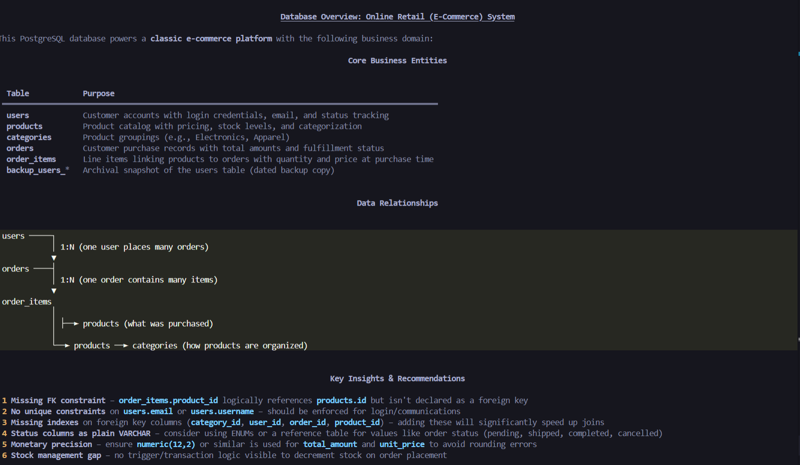
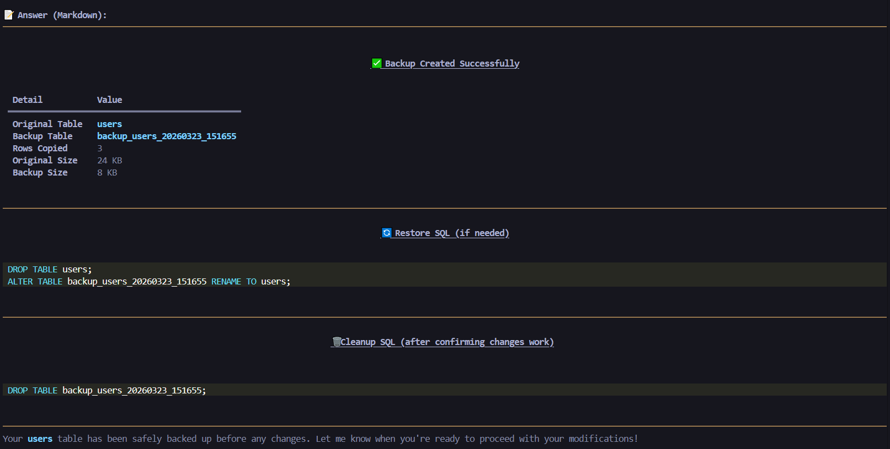
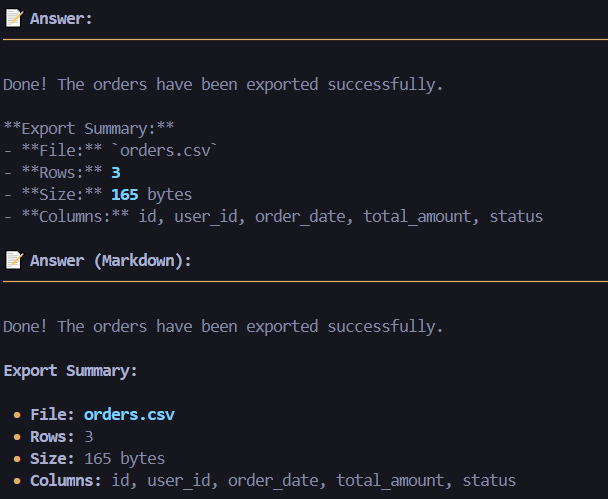
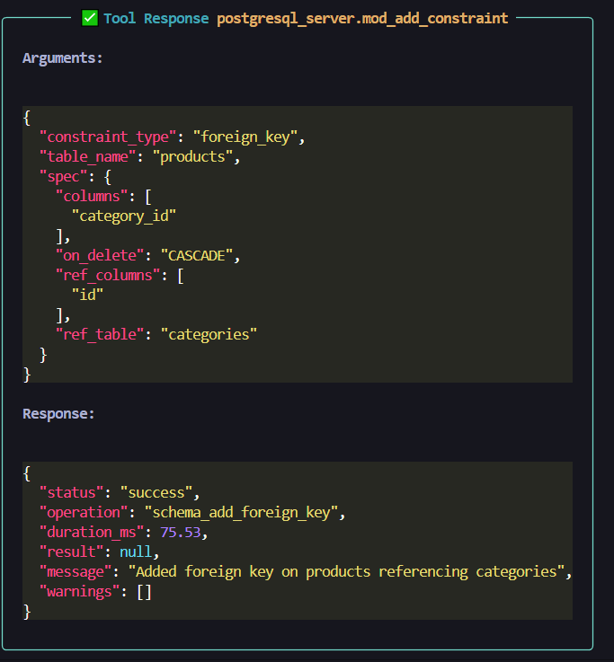
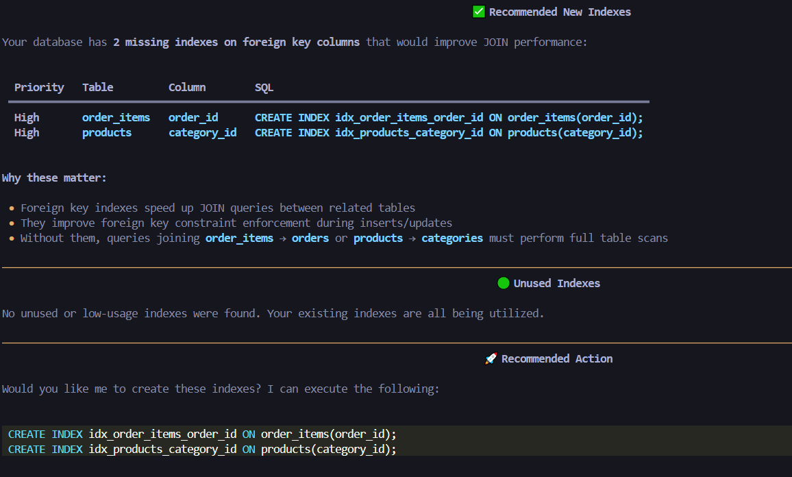
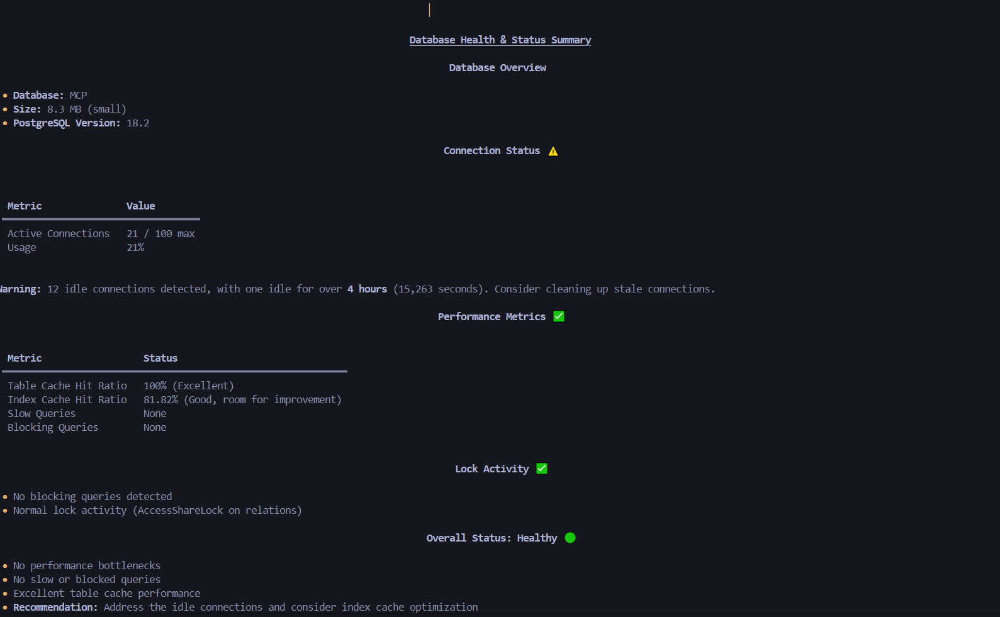
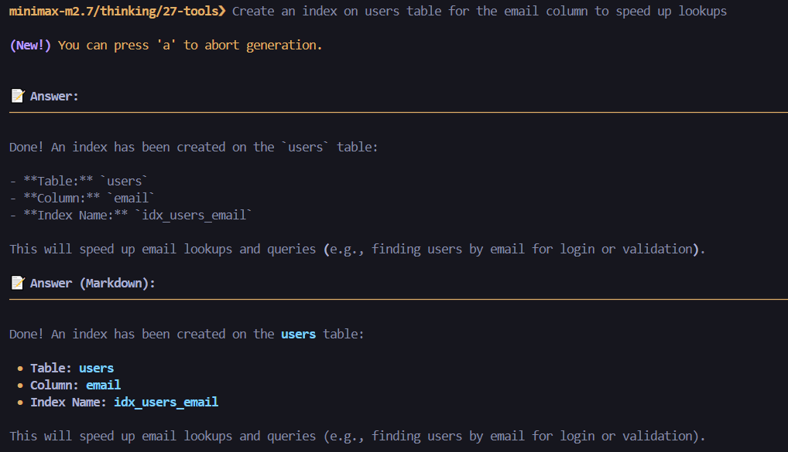
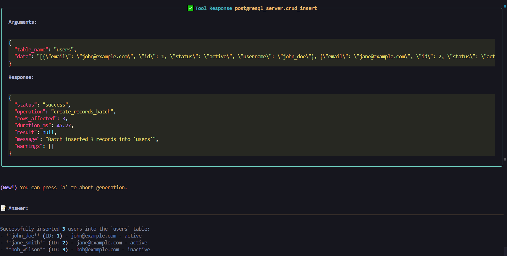
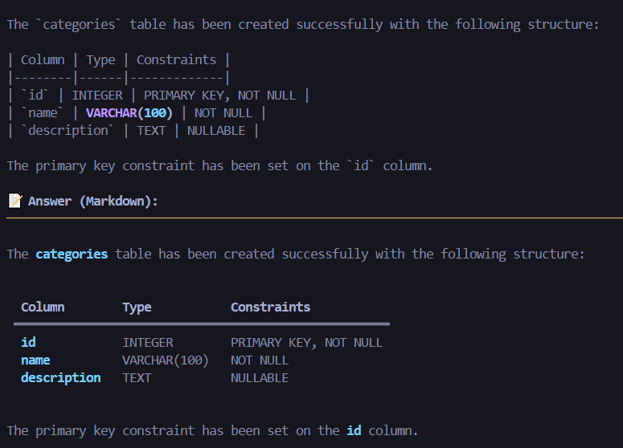

#   PostgreSQL MCP Server 

> Transforms PostgreSQL databases from "I have tables and I don't know what they do" into "I understand the entire database structure, relationships, and best practices"

##  Overview

This is an MCP (Model Context Protocol) server that provides intelligent analysis, documentation, and complete CRUD operations for PostgreSQL databases. It combines deterministic schema extraction with AI-powered reasoning and secure data manipulation operations to help users and AI agents understand and interact with complex database structures.

**Performance Optimized & Extended:** Started at 38 tools, optimized to 19 tools (~50% reduction), then strategically extended to 27 tools with high-value query optimization, data management, transactions, and monitoring capabilities.

###  Key Features

- **Comprehensive Coverage**: 27 carefully designed tools covering all PostgreSQL operations
- **Schema Extraction**: Automatically extract tables, columns, relationships, and constraints
- **Intelligent Analysis**: Detect junction tables, implicit relationships, and suggest optimal joins
- **AI-Powered Insights**: Leverage Ollama/LLM to generate business explanations and recommendations
- **Complete CRUD Operations**: Unified tools for all data manipulation with SQL injection prevention
- **Query Optimization**: Execution plan analysis, combined index analysis (suggest + unused detection)
- **Data Management**: Import/export (CSV/JSON/SQL), full-text search
- **Transaction Support**: Atomic multi-operation transactions with rollback
- **Monitoring**: Database statistics, cache metrics, slow queries, connection tracking
- **Multiple Output Formats**:
  - PlantUML ER diagrams (with SVG rendering)
  - PlantUML Class diagrams (with SVG rendering)
  - PlantUML Component diagrams (with SVG rendering)
  - Comprehensive Markdown documentation
  - Visual diagram files (SVG, PNG, PDF)
- **Query Assistance**: Smart join type recommendations (INNER vs LEFT)
- **Modular Architecture**: Clean, extensible design organized by capability
- **Diagram Rendering**: Auto-generate visual database structure diagrams
- **Security**: Parameterized queries, input validation, SQL injection prevention

---


##  Getting Started

### Prerequisites
- Python 3.11+
- PostgreSQL database
- Ollama server (optional, for AI explanations)
- `uv` package manager

### Installation

1. **Clone repository and install dependencies:**
   ```bash
   cd PostgreSQL-MCP
   uv sync
   ```

2. **Set environment variables** (create `.env`):
   ```env
   # PostgreSQL
   DB_HOST=localhost
   DB_PORT=5432
   DB_NAME=your_database
   DB_USER=postgres
   DB_PASSWORD=your_password

   # Ollama/LLM
   OLLAMA_BASE_URL=http://192.168.1.143:11434
   OLLAMA_MODEL=deepseek-r1:14b

   # App
   DEBUG=False
   ```

### Running the Server

```bash
# Start MCP server
uv run postgresql_server.py

```

---

##  Available MCP Tools (27 Total)

###  Category 1: Analysis & Schema Tools (5 tools)

#### 1. `analyze_database()`
Comprehensive schema analysis without LLM.
- Full schema structure (tables, columns, keys, data types)
- Junction tables detected
- Implicit relationships discovered
- Join suggestions (INNER vs LEFT)
- PlantUML ER diagram
- PlantUML Class diagram
- PlantUML Component diagram
- Comprehensive Markdown documentation

#### 2. `explain_database()`
AI-powered database analysis using Ollama LLM.
- Business explanation of database purpose
- Detected relationships and join recommendations
- Improved PlantUML ERD with AI insights
- Database quality recommendations

#### 3. `get_table_details(table_name: str)`
Detailed analysis of a specific table.
- Table structure and relationships
- Column information and constraints
- Table-specific Markdown documentation

#### 4. `get_database_info(info_type: str = "tables")`
**NEW: Unified info retrieval tool** - Consolidates list_tables, check_ollama_status
- `info_type="tables"`: List all tables with count
- `info_type="ollama"`: Check Ollama/LLM service status and available models
- `info_type="summary"`: Quick database statistics

#### 5. `render_database_diagrams(output_format: str = "svg")`
Generate visual database structure diagrams.
- ER Diagram (erd_svg.svg)
- Class Diagram (class_svg.svg)
- Component Diagram (component_svg.svg)
- SVG/PNG/PDF files in `diagrams/` directory

---

###  Category 2: CRUD Create Operations (4 tools)

#### 6. `crud_insert(table_name: str, data: Dict | List[Dict])`
**NEW: Smart insert** - Consolidates single and batch inserts
- **Single insert**: Pass Dict → `{"name": "John", "age": 30}`
- **Batch insert**: Pass List[Dict] → `[{"name": "John"}, {"name": "Jane"}]`
- Automatic detection of single vs batch mode
- Parameterized queries for SQL injection prevention

#### 7. `crud_create_table(table_name, columns, primary_key)`
Create a new table with columns and constraints.
- Define columns with types: `{"name": "id", "type": "INTEGER", "nullable": False}`
- Optional primary key specification
- Full constraint support

#### 8. `crud_create_view(view_name, select_query, replace_if_exists)`
Create database views from SELECT queries.
- Define virtual tables
- Optional view replacement

#### 9. `crud_create_index(index_name, table_name, columns, unique)`
Create single or composite indexes.
- Single column: `columns=["email"]`
- Composite: `columns=["last_name", "first_name"]`
- Optional UNIQUE constraint

---

###  Category 3: CRUD Read Operations (2 tools)

#### 10. `crud_query(query, params, limit, offset)`
**NEW: Raw SQL query execution** - For complex queries with JOINs and aggregations
- Execute any SELECT statement
- Parameterized values: Use `%s` placeholders
- Pagination support with limit/offset
- Example: `query="SELECT * FROM users WHERE age > %s", params=[30]`

#### 11. `crud_get(table_name, mode, where_clause, where_params, options)`
**NEW: Unified high-level read** - Consolidates 4 read operations
- `mode="records"`: Get filtered records (replaces crud_get_records)
- `mode="count"`: Count records (replaces crud_get_record_count)
- `mode="distinct"`: Get distinct values (replaces crud_distinct_values)
- `mode="paginate"`: Paginated results with metadata (replaces crud_paginate_data)
- Full WHERE clause, ordering, and filter support

---

### Category 4: CRUD Update Operations (2 tools)

#### 12. `crud_update(table_name, values, where_clause, where_params, id_column, record_id)`
**NEW: Unified update** - Consolidates single, batch, and column updates
- **Single record**: Provide `record_id` + `id_column`
- **Batch update**: Provide `where_clause` + `where_params`
- **Column update**: Single key-value in `values` dict
- Parameterized queries for security

#### 13. `crud_rename(object_type, old_name, new_name, table_name)`
**NEW: Rename anything** - Consolidates table and column rename
- `object_type="table"`: Rename table
- `object_type="column"`: Rename column (requires `table_name`)
- Safe renaming with validation

---

###  Category 5: CRUD Delete Operations (1 tool)

#### 14. `crud_delete(table_name, mode, where_clause, where_params, id_column, record_id, cascade)`
**NEW: Unified deletion** - Consolidates 4 delete operations
- `mode="records"`: Delete specific records (single or batch)
  - Single: Provide `record_id` + `id_column`
  - Batch: Provide `where_clause` + `where_params`
- `mode="truncate"`: Clear all data (fast, resets sequences)
- `mode="drop"`: Drop entire table (WARNING: destroys structure)
- Optional `cascade` for dependent objects

---

###  Category 6: Schema Modification (5 tools)

#### 15. `mod_column(table_name, action, column_name, column_spec, cascade)`
**NEW: Unified column management** - Consolidates 4 column operations
- `action="add"`: Add new column → `column_spec={"name": "status", "type": "VARCHAR(50)"}`
- `action="modify_type"`: Change data type → `column_spec={"new_type": "TEXT"}`
- `action="drop"`: Remove column
- `action="set_nullable"`: Toggle NULL constraint → `column_spec={"is_nullable": True}`

#### 16. `mod_index(action, index_name, table_name, cascade)`
**NEW: Index management** - Consolidates list and drop operations
- `action="list"`: List all indexes (optionally filtered by table)
- `action="drop"`: Drop index with optional cascade

#### 17. `mod_constraint(action, table_name, constraint_name, cascade)`
**NEW: Constraint management** - Consolidates list and drop operations
- `action="list"`: List all constraints (PK, FK, unique, check)
- `action="drop"`: Drop constraint with optional cascade

#### 18. `mod_add_constraint(constraint_type, table_name, spec)`
**NEW: Add constraints** - Consolidates primary key and foreign key addition
- `constraint_type="primary_key"` + `spec={"columns": ["id"]}`
- `constraint_type="foreign_key"` + `spec={"columns": ["user_id"], "ref_table": "users", "ref_columns": ["id"], "on_delete": "CASCADE"}`

#### 19. `mod_view(action, view_name, cascade)`
**NEW: View management** - Consolidates 3 view operations
- `action="list"`: List all views
- `action="get"`: Get view SQL definition
- `action="drop"`: Drop view with optional cascade

---

###  Category 7: Phase 3-6 Extended Tools (8 tools)

#### 20. `query_explain(query, analyze, format)`
Get EXPLAIN / EXPLAIN ANALYZE output for any SQL query.
- `analyze=False`: Show estimated plan only
- `analyze=True`: Run query and show actual row counts and timings
- `format`: `"text"` (default) or `"json"`

#### 21. `query_analyze_indexes(mode, table_name, min_size_mb)`
Combined index analysis — suggest missing indexes or detect unused ones.
- `mode="suggest"`: Recommend indexes for FK columns and large tables (optionally scoped to `table_name`)
- `mode="unused"`: Find indexes with zero/low scan counts above `min_size_mb`
- `mode="all"`: Run both analyses and return a combined report

#### 22. `data_export(table_name, format, where_clause, where_params, columns, limit)`
Export table data to CSV, JSON, or SQL INSERT format.
- Supports column selection, WHERE filtering, and row limits
- JSON output includes schema metadata

#### 23. `data_import(table_name, data, format, column_mapping, conflict_action)`
Import data from CSV or JSON into a table.
- `conflict_action`: `"error"` | `"ignore"` | `"update"`
- `column_mapping`: Rename incoming fields to match table columns

#### 24. `data_search(table_name, search_term, columns, search_type, limit)`
Full-text search across specified columns.
- `search_type`: `"ilike"` (case-insensitive), `"like"` (case-sensitive), `"fuzzy"` (similarity)
- Searches all text columns when `columns` is omitted

#### 25. `transaction_execute(operations, rollback_on_error)`
Run multiple SQL operations atomically in a single transaction.
- Each operation: `{"sql": "...", "params": [...]}`
- Auto-rollback on any failure when `rollback_on_error=True`

#### 26. `transaction_backup_table(table_name, backup_name, include_indexes)`
Create a quick snapshot backup of a table.
- Copies data and optionally recreates indexes on the backup
- Returns restore SQL to recover or diff against original

#### 27. `monitoring_database_stats(stat_type)`
Comprehensive database health and performance monitoring.
- `stat_type`: `"summary"` | `"size"` | `"connections"` | `"cache_hit_ratio"` | `"slow_queries"` | `"locks"` | `"all"`

---
**Use OLLMCP client for locally testing with ollama providers**
---

**Security Features (All Operations):**
-  Parameterized queries (prevents SQL injection)
-  Input validation (table/column name validation)
-  Constraint checking (validates data types and constraints)
-  Standardized response format with status and duration
---
**CRUD & SCHEMA ANALYSIS VIDEO**
[](https://drive.google.com/file/d/1neyl0bAqyX_0_sCIPTnmZFYL33Ykisva/view)

**Refer to [AGENT_TESTING_SUITE.md](AGENT_TESTING_SUITE.md) for complete testing flow**

## Here are images of the some tool in action:

## Overview of Database


## Backup Table


## Export data to CSV/JSON/SQL


## Foreign Key Tool


## Suggest New Indexes


## Database Monitoring


## Create New Index


## CRUD Operations





## Refer to [diagrams/](./diagrams) folder to view Generated ERD Diagrams

---


## 🤝 Contributing

This project is OpenSource. Contributions are welcome.

---
